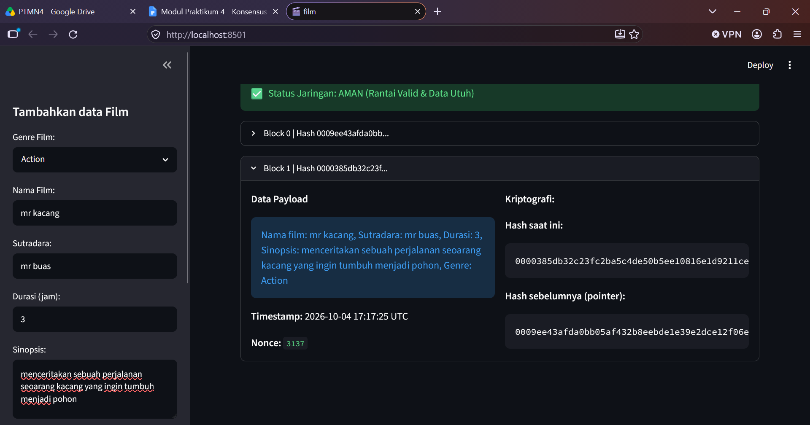

# LAPORAN PRAKTIKUM BLOCKCHAIN

## kelompok ##
1. fakhri muhtasib
2. muhammad haekal bilal
3. putra rais hakim

---

---

---

---
## I. TUJUAN PRAKTIKUM
1. Mahasiswa memahami konsep **Mempool** dan mekanisme validasi transaksi sebelum masuk ke dalam blok.
2. Mahasiswa mampu mengimplementasikan algoritma **Proof of Work (PoW)** pada struktur Blockchain lokal.
3. Mahasiswa memahami fungsi **Nonce** (*Number Only Used Once*) dan **Difficulty** dalam proses *mining*.
4. Mahasiswa mampu memvalidasi integritas rantai secara keseluruhan menggunakan skrip Python.

---

## II. DASAR TEORI

### 1. Mempool dan Validasi Transaksi
Mempool (*Memory Pool*) berfungsi sebagai ruang penampung sementara bagi data transaksi sebelum dimasukkan ke dalam blok resmi oleh penambang (*miner*).

### 2. Proof of Work (PoW) dan Nonce
Proof of Work (PoW) adalah mekanisme konsensus yang mewajibkan penambang menghabiskan daya komputasi untuk menyelesaikan teka-teki kriptografi. Parameter **Nonce** adalah variabel numerik acak yang terus dinaikkan nilainya hingga hasil pengkodean hash SHA-256 memenuhi kriteria awalan nol yang ditetapkan.

### 3. Tingkat Kesulitan (*Difficulty*) Kriptografi
*Difficulty* menentukan batas kriteria hash yang valid. Karena output SHA-256 disajikan dalam format heksadesimal ($16$ simbol: $0-9$ dan $a-f$), probabilitas mendapatkan satu digit nol diawal hash adalah $\frac{1}{16}$. Untuk $d$ buah digit nol berturut-turut, probabilitas keberhasilannya adalah:

$$P(d) = \left(\frac{1}{16}\right)^d = 16^{-d}$$

Rata-rata percobaan *nonce* yang dibutuhkan adalah $E(d) = 16^d$.

---

## III. SKENARIO PENGUJIEN & SIMULASI HACK

### 1. Eksekusi Peretasan Memori ("HACK BLOK 1")
Pengujian dilakukan untuk membuktikan ketahanan sistem validasi blockchain terhadap manipulasi data:
1. Pengguna memasukkan data film baru hingga terbentuk minimal **Blok Index 1**.
2. Pengguna menekan tombol **"💥 HACK BLOK 1"** pada sidebar. Skrip mengeksekusi manipulasi data secara langsung di memori:
   ```python
   st.session_state.my_blockchain.chain[1].data = "DATA PALSU!"
   ```
3. Pengguna menekan tombol **"🛡️ Cek Integritas Rantai"**.

### 2. Hasil Pembuktian Sistem
Saat tombol ditekan, fungsi `is_chain_valid()` melakukan perhitungan ulang (*re-calculate*) terhadap hash Blok Index 1. Karena data payload berubah menjadi `"DATA PALSU!"`, nilai hash baru tidak lagi cocok dengan nilai `hash` yang tercatat pada saat blok ditambang.

Sistem Streamlit secara otomatis mendeteksi ketidaksesuaian ini dan memunculkan indikator peringatan:
> **🚨 Status Jaringan: BAHAYA (Data telah dimanipulasi!)**

---

## IV. ANALISIS DIFFICULTY DAN KECEPATAN MINING

Sesuai instruksi praktikum, dilakukan pengujian dengan mengubah variabel `self.difficulty` pada `core.py` dari nilai **3** menjadi **4** dan **5**.

### 1. Tabel Perbandingan Hasil Pengujian

| Nilai `self.difficulty` | Target Prefiks Hash | Estimasi Rata-rata Iterasi Nonce ($16^d$) | Perubahan Kecepatan Mining |
| :---: | :---: | :---: | :---: |
| **3** | `000...` | $\approx 4.096$ kali | Sangat Cepat ($< 0.05$ detik) |
| **4** | `0000...` | $\approx 65.536$ kali | Terasa Ada Jeda ($\approx 0.2 - 0.5$ detik) |
| **5** | `00000...` | $\approx 1.048.576$ kali | Lambat ($\approx 2.0 - 5.0$ detik) |

### 2. Pembahasan dan Diskusi

* **Apa yang terjadi pada kecepatan penambahan blok saat difficulty dinaikkan?**  
  Kecepatan penambahan blok mengalami **penurunan drastis (waktu komputasi membengkak secara eksponensial)**. Saat `self.difficulty` dinaikkan dari 3 ke 4 atau 5, proses penambangan membutuhkan waktu yang jauh lebih lama hingga perangkat sempat mengalami jeda loading.

* **Mengapa demikian?**  
  Hal ini disebabkan oleh penyempitan ruang pencarian nilai target hash. Setiap kali nilai *difficulty* dinaikkan sebesar $1$ tingkat, jumlah kemungkinan hash yang memenuhi syarat berkurang sebesar $16$ kali lipat. 
  
  Sistem dipaksa untuk menjalankan iterasi fungsi `calculate_hash()` secara berulang-ulang sebanyak rata-rata $16$ kali lipat lebih banyak dibandingkan tingkat sebelumnya. Pada *difficulty* 5, sistem CPU harus melakukan pencacahan *nonce* rata-rata lebih dari **1 juta kali** untuk menemukan 1 hash yang valid.

---

## V. KESIMPULAN

1. Simulasi peretasan memori melalui tombol **"💥 HACK BLOK 1"** berhasil membuktikan bahwa perubahan data sekecil apapun akan langsung terdeteksi oleh fungsi `is_chain_valid()`.
2. Parameter *Nonce* dan *Difficulty* terbukti efektif mengontrol beban kerja penambangan dalam algoritma Proof of Work (PoW).
3. Peningkatan nilai *difficulty* menurunkan kecepatan *mining* secara eksponensial dengan faktor perkalian $16^d$, yang berfungsi sebagai perlindungan utama jaringan blockchain dari manipulasi data secara masif.