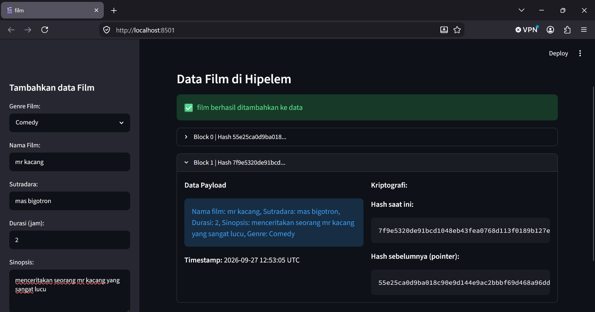

# 📚pratikum blockchain pertemuan 4 #

## kelompok ##
1. fakhri muhtasib
2. muhammad haekal bilal
3. putra rais hakim

## SS ##

### tujuan pratikum ###
1. Mahasiswa memahami konsep Object-Oriented Programming (OOP) pada Python melalui
pembuatan Class.
2. Mahasiswa mampu mengimplementasikan arsitektur modular dengan memisahkan logika
Backend (Core) dan antarmuka Frontend (UI).
3. Mahasiswa dapat membangun struktur Linked List terenkripsi menggunakan Hash
Pointers.
4. Mahasiswa mampu mensimulasikan sistem "Traceability Rantai Pasok Kopi" sederhana di
lingkungan lokal.

### deskripsi pratikum ###
1. membuat 2 buah file di dalam satu folder ptmn 3 yaitu : 'core.py' dan 'app.py'