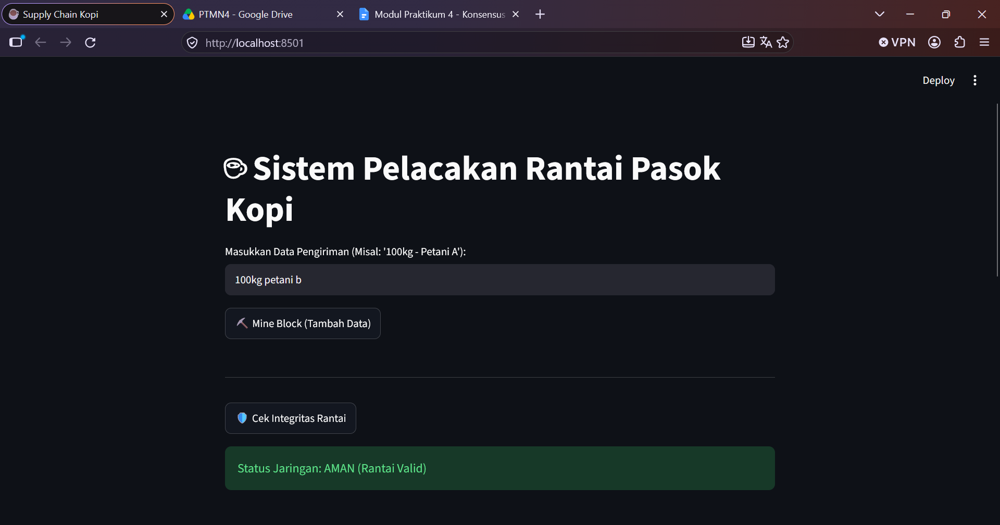

# LAPORAN PRAKTIKUM BLOCKCHAIN

**Mata Kuliah:** Teknologi Blockchain / Keamanan Informasi  
**Topik:** Implementasi Proof of Work (PoW), Nonce, Difficulty, dan Validasi Integritas Rantai pada Sistem Pelacakan Rantai Pasok Kopi  
---

---

---
## II. TUJUAN PRAKTIKUM

1. Mahasiswa memahami konsep **Mempool** dan mekanisme validasi transaksi sebelum masuk ke dalam blok.
2. Mahasiswa mampu mengimplementasikan algoritma **Proof of Work (PoW)** pada struktur Blockchain lokal.
3. Mahasiswa memahami fungsi **Nonce** (*Number Only Used Once*) dan **Difficulty** dalam proses mining.
4. Mahasiswa mampu memvalidasi integritas rantai secara keseluruhan menggunakan skrip Python.

---

## III. DASAR TEORI

### 1. Mempool dan Validasi Transaksi
*Mempool* (Memory Pool) merupakan area penampungan sementara bagi transaksi yang baru dibuat sebelum divalidasi dan dimasukkan ke dalam blok permanen oleh penambang (*miner*). Proses validasi memastikan bahwa data yang masuk memenuhi standar keamanan dan aturan konsensus jaringan.

### 2. Proof of Work (PoW)
Proof of Work (PoW) adalah algoritma konsensus yang menuntut *miner* melakukan komputasi untuk memecahkan teka-teki matematis/kriptografi sebelum diizinkan menambahkan blok baru ke dalam rantai. Metode ini menjaga keamanan jaringan dari potensi manipulasi data atau serangan *spam*.

### 3. Nonce dan Difficulty
* **Nonce (*Number Only Used Once*):** Variabel angka acak yang diubah nilainya secara berulang (*iterasi*) oleh penambang untuk menghasilkan nilai hash yang memenuhi kriteria target.
* **Difficulty:** Parameter yang menentukan tingkat kesulitan teka-teki PoW, diwakili oleh jumlah angka nol berurutan di awal *hash* target.

$$
\text{Hash Target} = \underbrace{00\dots0}_{\text{difficulty}} \text{XXXXXXXX...}
$$

### 4. Cryptographic Hash (SHA-256) & Integritas Rantai
Algoritma SHA-256 mengubah input data acak menjadi output berukuran tetap sepanjang 64 karakter heksadesimal. Setiap blok menyimpan *hash* dari blok sebelumnya (`previous_hash`). Perubahan satu karakter saja pada data blok lama akan mengubah total nilai *hash* (*Avalanche Effect*), yang mengakibatkan keterkaitan rantai terputus dan status integritas menjadi tidak valid.

---

## IV. ARSITEKTUR DAN STRUKTUR SISTEM

Praktikum ini diimplementasikan menggunakan bahasa pemrogramam Python dan antarmuka berbasis web menggunakan antarmuka **Streamlit**. Sistem dibagi menjadi dua modul utama tanpa menyertakan kode secara langsung:

### 1. Modul Inti (`core.py`)
Modul ini bertanggung jawab atas seluruh logika kriptografi dan struktur data blockchain:
* **Struktur Kelas `Block`:** Menyimpan informasi indeks blok, *stempel waktu* (*timestamp*), data pengiriman kopi, *hash* blok sebelumnya (`previous_hash`), nilai `nonce`, serta *hash* blok saat ini.
* **Fungsi Perhitungan Hash (`calculate_hash`):** Menggabungkan seluruh atribut blok (termasuk `nonce`) dan mengisinya ke dalam fungsi kriptografi SHA-256.
* **Fungsi Penambangan (`mine_block`):** Menjalankan perulangan pencarian *nonce* hingga menghasilkan *hash* yang diawali oleh karakter nol sebanyak nilai `difficulty` yang ditentukan.
* **Struktur Kelas `Blockchain`:** Mengelola rantai blok (*chain*), pembuatan *Genesis Block* (blok pertama), penambahan blok baru, serta penetapan tingkat *difficulty*.
* **Fungsi Validasi Rantai (`is_chain_valid`):** Memeriksa ulang seluruh blok dari awal hingga akhir untuk memastikan bahwa *hash* setiap blok konsisten dengan datanya dan `previous_hash` sesuai dengan *hash* blok sebelumnya.

### 2. Modul Antarmuka Pengguna (`app.py`)
Modul ini menyajikan antarmuka visual interaktif untuk simulasi rantai pasok kopi:
* **Form Input Data:** Tempat pengguna memasukkan informasi pengiriman kopi (misalnya: *"100kg - Petani A"*).
* **Tombol Mining:** Memicu pemanggilan fungsi *Proof of Work* untuk memproses data dari penampungan (*mempool*) menjadi blok terenkripsi.
* **Tombol Cek Integritas:** Memanggil fungsi validasi rantai untuk memeriksa apakah ada manipulasi data di dalam ledger.
* **Tampilan Buku Besar (*Ledger*):** Menampilkan daftar blok yang tersimpan secara runut beserta detail nilai *timestamp*, data, *nonce*, `previous_hash`, dan *hash* resmi blok.

---

## V. ANALISIS DAN PEMBAHASAN

### 1. Mekanisme Proof of Work (PoW) dan Peran Nonce
Dalam percobaan ini, tingkat *difficulty* diatur pada angka `3`. Hal ini mewajibkan algoritma PoW untuk menemukan kombinasi *hash* yang diawali dengan string `"000"`.
* Karena atribut seperti *timestamp*, data, dan *index* bernilai tetap saat blok dibuat, variabel **`nonce`** menjadi satu-satunya parameter yang nilainya terus ditambah $+1$ pada setiap iterasi.
* Proses komputasi akan terus berulang hingga diperoleh nilai *nonce* yang menghasilkan *hash* berawalan `"000"`. Nilai *nonce* ini menjadi bukti sah bahwa proses komputasi (*work*) telah diselesaikan.

### 2. Pengujian Integritas Rantai (Chain Validation)
Pengecekan integritas rantai dilakukan melalui dua tahap verifikasi:
1. **Verifikasi Hash Mandiri:** Memastikan bahwa data di dalam blok tidak diubah secara paksa. Jika data berubah, kalkulasi ulang *hash* tidak akan cocok dengan nilai *hash* yang tercatat.
2. **Verifikasi Pointer Rantai:** Memastikan bahwa nilai `previous_hash` pada blok ke-$i$ tepat sama dengan nilai *hash* pada blok ke-$(i-1)$.

### 3. Simulasi Kasus Rantai Pasok Kopi
1. Sistem menginisialisasi **Genesis Block** sebagai titik awal rantai secara otomatis.
2. Saat data pengiriman baru diinputkan, sistem menjalankan indikator proses (*spinner*) selama perhitungan PoW berlangsung hingga *nonce* yang tepat ditemukan.
3. Setelah blok berhasil ditambang, blok ditambahkan ke dalam ledger.
4. Pengujian integritas mengonfirmasi status **"AMAN (Rantai Valid)"** selama tidak ada pengubahan variabel secara langsung tanpa proses *re-mining*.

---

## VI. KESIMPULAN

1. **Mempool dan Validasi Transaksi:** Data entri rantai pasok kopi divalidasi terlebih dahulu melalui mekanisme komputasi sebelum dapat dicatat secara permanen ke dalam buku besar (*ledger*).
2. **Penerapan Proof of Work (PoW):** Algoritma PoW berhasil diimplementasikan untuk mengamankan proses penambahan blok baru melalui pencarian pola *hash* target.
3. **Fungsi Nonce & Difficulty:** *Nonce* berfungsi sebagai variabel penentu iterasi pencarian *hash*, sedangkan *difficulty* mengontrol seberapa berat beban komputasi yang dibutuhkan untuk menambang blok.
4. **Validasi Rantai:** Kombinasi pengecekan *hash* mandiri dan *previous_hash* terbukti efektif dalam mendeteksi dan mencegah upaya manipulasi data pada sistem blockchain lokal.